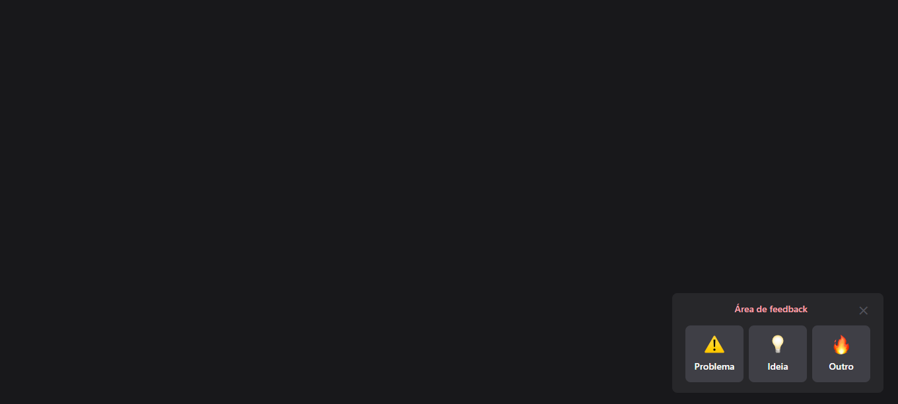

# Widget de Feedback
Projeto simples apenas para desenvolver feature de feedback.



## 🚀 Tecnologias
- ✔️ VueJS 3 - Framework web
- ✔️ Vuex 4 - Gerenciamento de estado global
- ✔️ Vite - Bundler e dev-server
- ✔️ Tailwind CSS - Framework CSS

## 📦️ Pré-Requisitos
Antes de começar você vai precisar ter instalado na sua máquina as ferramentas [Git](https://git-scm.com/) e [Node](https://nodejs.org/en/download/).

## ⚡ Executando o projeto
1. Clone o repositório
```
    git clone https://github.com/DouglasLacerdaC/WidgetFeedback.git
```
2. Acesse a pasta do projeto e instale as dependências
```
    yarn
```
3. Execute o projeto
```
    yarn dev
```
4. Acesse pelo navegador
```
    http://127.0.0.1:5173/
```

<br />

Desenvolvido por [Douglas Lacerda](https://www.linkedin.com/in/douglas-lacerda-da-conceicao/)